# Golang 设计模式

## 一、设计原则
1. 单一职责原则（Single Responsibility Principle）  
设计目的单一的类,只负责一个功能领域中的相应职责
2. 开闭原则（Open-Closed Principle）  
对扩展开放，对修改关闭，尽量在不修改原有代码上扩展
3. 里氏替换原则（Liskov Substitution Prinicple）  
引用父类的地方均可以使用子类替换
4. 依赖倒置原则（Dependece Inversion Principle）  
细节应该依赖抽象，抽象不应该依赖细节，针对接口编程而非实现编程
5. 接口隔离原则（Interface Segregation Principle）  
使用多个专门的接口，而非单一总接口
6. 组合重用原则（Composite Reuse Principle）  
尽量使用对象组合，而不是继承来达到复用的目的
7. 迪米特原则/最少知识原则（Law of Demeter）  
一个对象应对其他对象尽可能少的了解

## 二、设计模式
#### 面对对象设计模式均为对象模式，其中【工厂/适配器/解释器/模板方法】也可采用类模式
#### 对象模式与类模式的区别：对象模式遵循组合重用原则，类模式继承重用
### 1、创建型模式
处理对象创建的设计模式，关注对象的创建，抽象创建对象的过程。

#### 1.1 单例Singleton
保证一个类只有一个实例，该类能自动创建这个实例并提供一个全局访问接口
##### 优点：减少内存开销
##### 场景：全局访问可优化和共享资源的访问

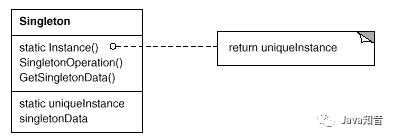

示例：
#### 1.2 原型Prototype
用一个已经创建的实例作为原型，通过复制该原型对象来创建一个和原型相同或近似的新对象
##### 优点：性能上比直接实例化新对象更优良
##### 缺点：需要为每个类都配置一个clone方法，修改clone方法违背开闭原则

示例：
#### 1.3 工厂方法FactoryMetiod
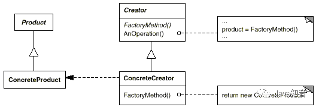

示例：
#### 1.4 抽象工厂AbstractFactory
工厂方法只能生产单个产品，抽象工厂可以生产多个产品

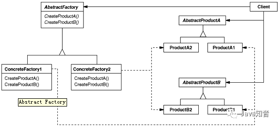

示例：

#### 1.5 构建器Builder
将一个复杂的对象的构造与它的表示分离，使同样的构建过程可以创建不同的表示，即每个部分可以灵活选择

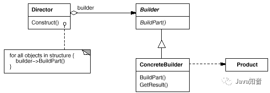

示例：
### 2、结构型模式
关注类和对象的组合。继承的概念被用来组合接口和定义组合对象获得新功能的方式。
#### 2.1 适配器Adapter
接口转换，解决兼容性问题

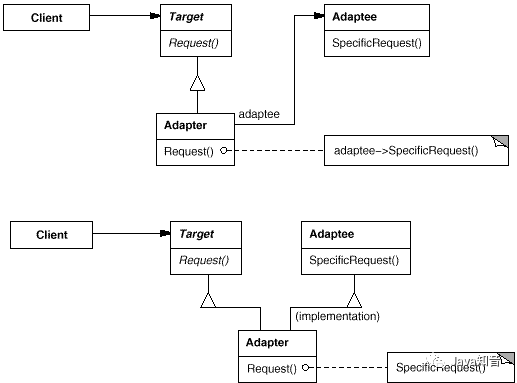

示例：[ ./Structural/01-Adapter]()
#### 2.2 代理Proxy
为其他对象的访问提供代理或占位符对象，快捷方式

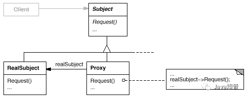

示例：[ ./Structural/]()

#### 注：适配器与代理模式的区别
* 目的不同：适配器改变原对象的接口，解决兼容问题；代理模式使客户端不直接与真正目标对象通信
* 场景不同：没有适配器类功能无法直接使用；没有代理类，功能仍可直接使用

  (若调用方法与接口方法一致，一般为代理模式，若调用方法与接口方法不一致，一般为适配器模式)

#### 2.3 享元Flyweight
通过共享对象减少对象数量，如汉字编码

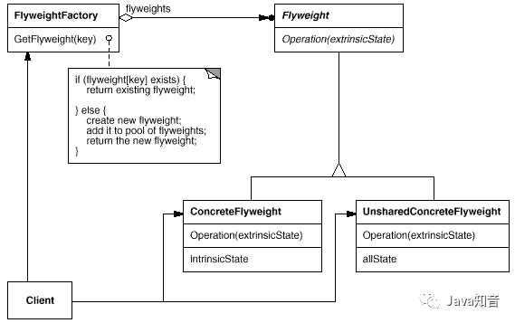

#### 2.4 外观Facade
定义统一的高层访问接口，为系统中的一组接口提供一致性外观

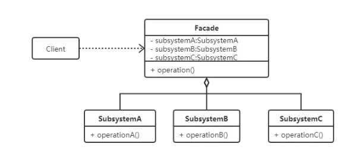

#### 2.5 组合Composite
将对象组合成树形结构表示整体与部分的层次结构，该结构的所有元素有一致的方法

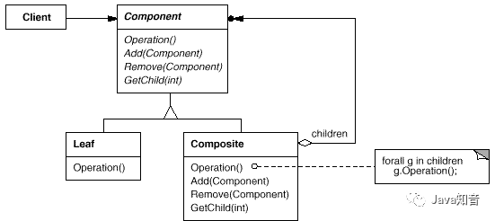

#### 2.6 装饰Decorator
动态的给对象附加额外的职责，代替子类扩展功能，更加灵活

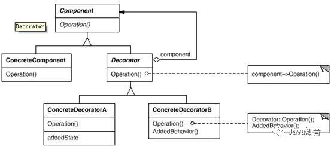

#### 2.7 桥接Bridge
抽象与操作分离，两者可以分别独立变化

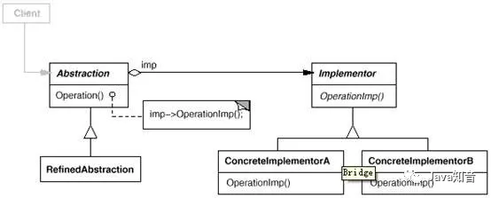

### 3、行为型模式
关注算法和对象间职责的分配，描述多个类或对象之间协作完成单个对象无法完成的任务。
#### 3.1 解释器Interpreter
提供了语法和解释器，用解释器解释语法，自定义、虚拟机等场景

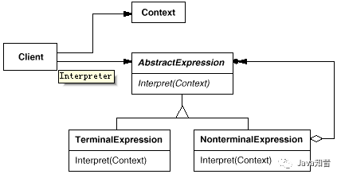

#### 3.2 模板方法TemplateMethod
定义算法骨架，将一些步骤延迟到子类中加载，可以重新定义某些步骤，框架场景

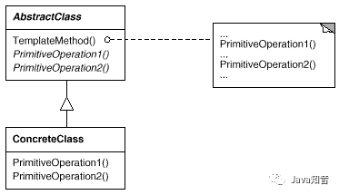

#### 3.3 责任链ResponsibilityChain
减少请求发送者与接受者之间的耦合，将对象链接起来，在链中传递请求

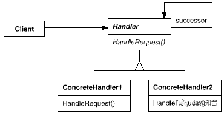

#### 3.4 命令Command
可撤销，将命令封装，将发出命令的职责和执行职责分开，实现解耦

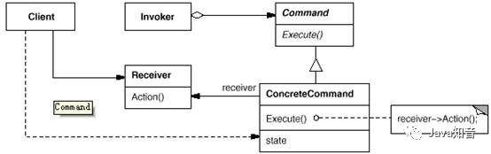

#### 3.5 迭代器Iterator
数据集，提供一种方法顺序访问一个聚合对象中的各种元素，而不暴露该对象的内部表示

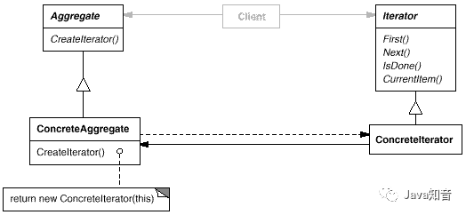

#### 3.6 中介者Mediator
中介处理对象间交互，对象之间无需显示调用，达到低耦合

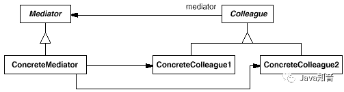

#### 3.7 备忘录Memento
不破坏封装性，捕获对象状态并保存，以后可恢复

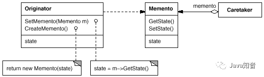

#### 3.8 观察者Observer
定义对象一对多依赖，一个对象改变状态，自动通知所有关联对象，订阅

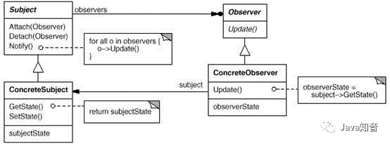

#### 3.9 状态State
对象的状态改变行为
 
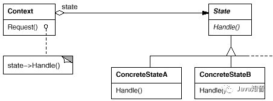

#### 3.10 策略Strategy
定义独立的算法可以自由切换

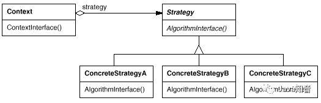

#### 3.11 访问者Visitor
操作与数据结构分离，数据结构稳定而算法易变的系统，每个操作都是一个独立的访问者，操作可以自由变换。

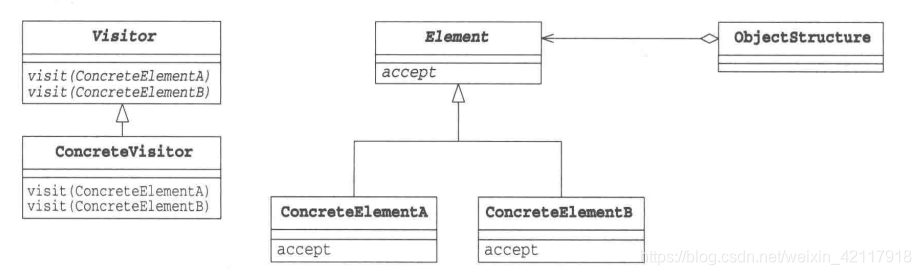